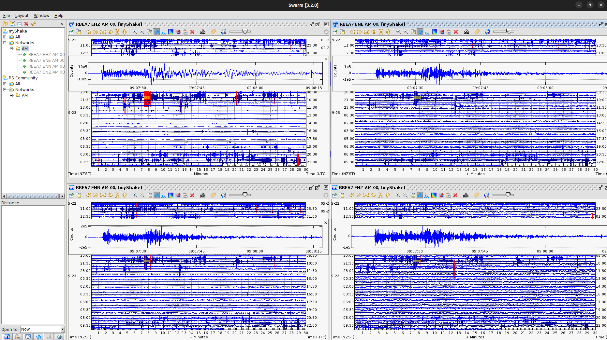
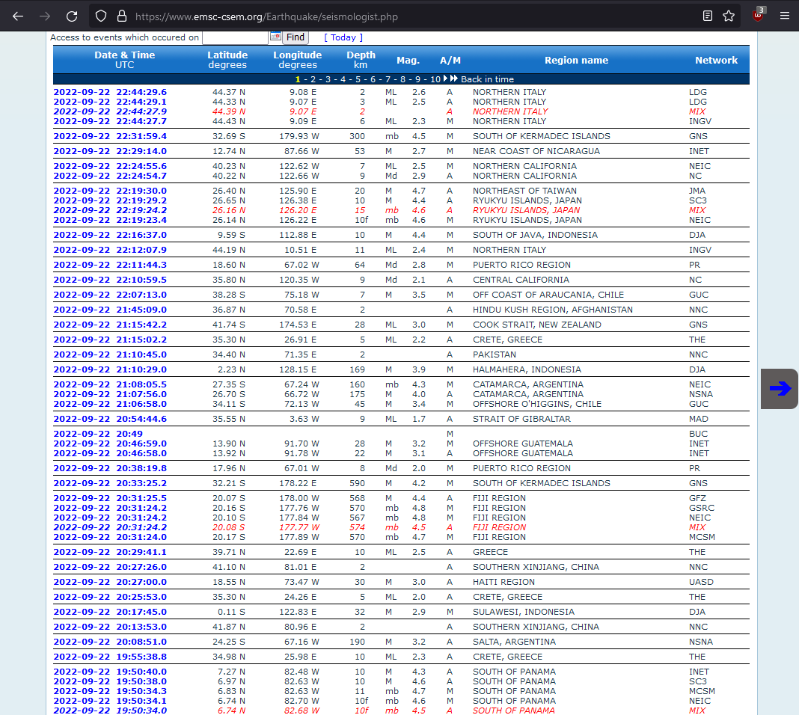

<h3>Data Tutorial</h3>

 
Geodata requires string values within GeoJSON, no numbers. For this reason test data is packaged with the application.

 

Data included with application:

* One Week [NZ](./1W_GeoNet.json) | [Worldwide](./1W_USGS.json)
* One Month [NZ](./1M_GeoNet.json) | [Worldwide](./1M_USGS.json)
* One Year [NZ](./1Y_GeoNet.json) | [Worldwide](./1Y_USGS.json)
* [kaikora.json](./kaikora.json) | [original](https://quakesearch.geonet.org.nz/geojson?bbox=163.5205,-49.1817,-176.9238,-32.2871&startdate=2016-11-7T0:00:00&enddate=2016-11-14T1:00:00)
* [swarm.json](./swarm.json)
* [USGS_7+.json](./USGS_7%2B.json)
* [USGS2000.json](./USGS2000.json)

 

<h3>Modify GeoJSON to support Geodata</h3>
 

This earthquake data was downloaded via the GeoNet Quake Search. Although Geodata supports GeoJSON format, the application does not currently support intager and floating values - only string values.

 

Requiring the end user to modify the GeoJSON data, altering numbers to string within the `properties` section.

 

 

<h2>How seismic data is visualised today</h2>
Identify areas of high siesmic activity, or anomolies through two dimentional map with limited funtionality.

There was a website named world-earthqukes.com that presented earthquake statistics, assisting with the forcast of siesmic activity over a period of time ranging from hours, weeks or months.

 

[<h3>SWARM</h3>](https://www.usgs.gov/software/swarm)

[<h3>GeoNet</h3>](https://geonet.org.nz)

[<h3>EMSC</h3>](https://emsc-csem.org)

[<h3>USGS</h3>](https://earthquake.usgs.gov/earthquakes/map)
