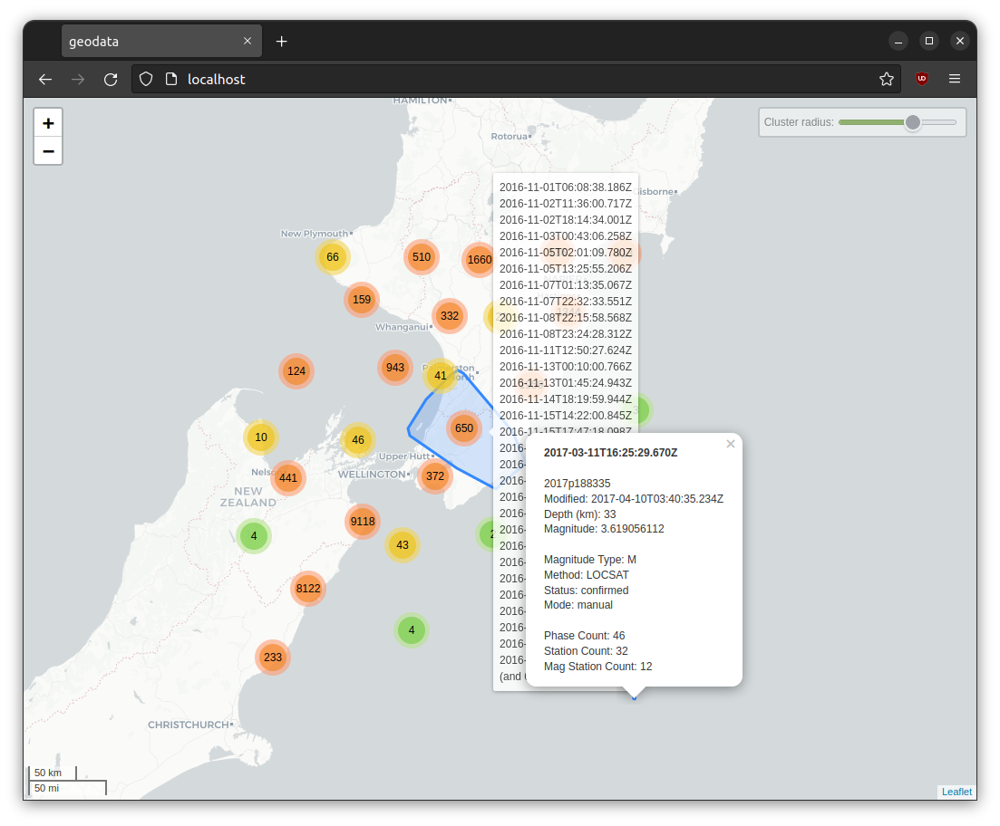
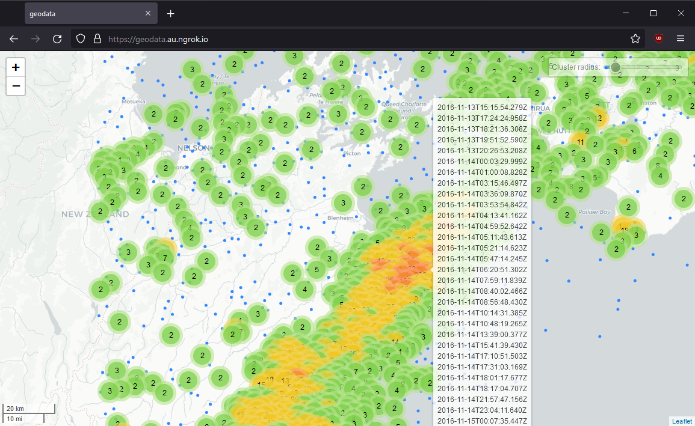
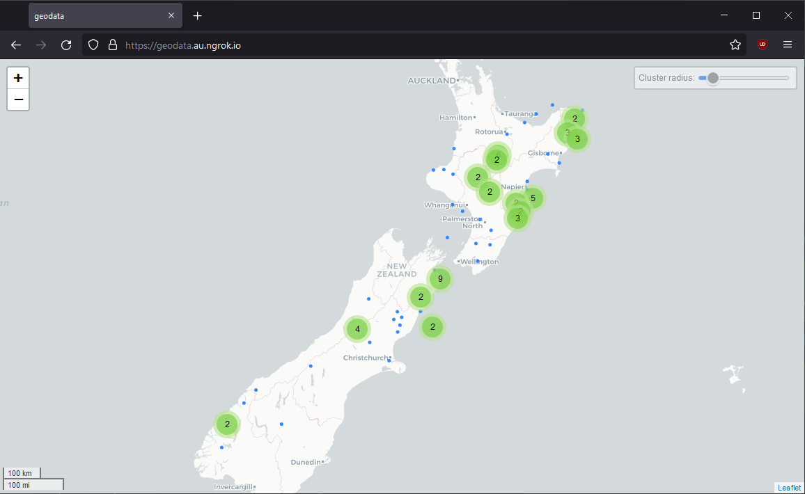
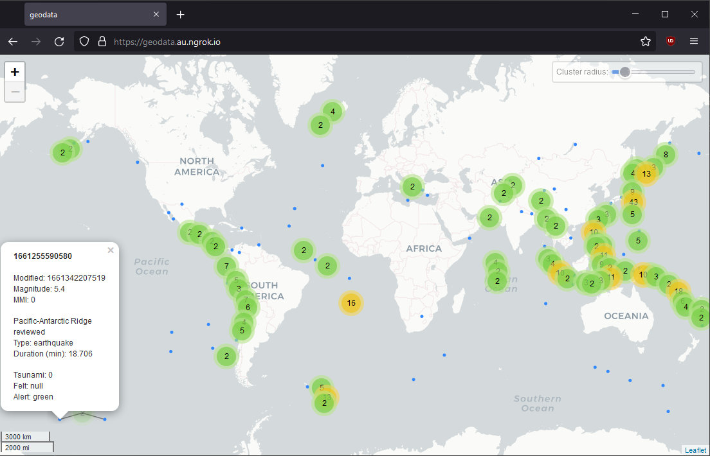
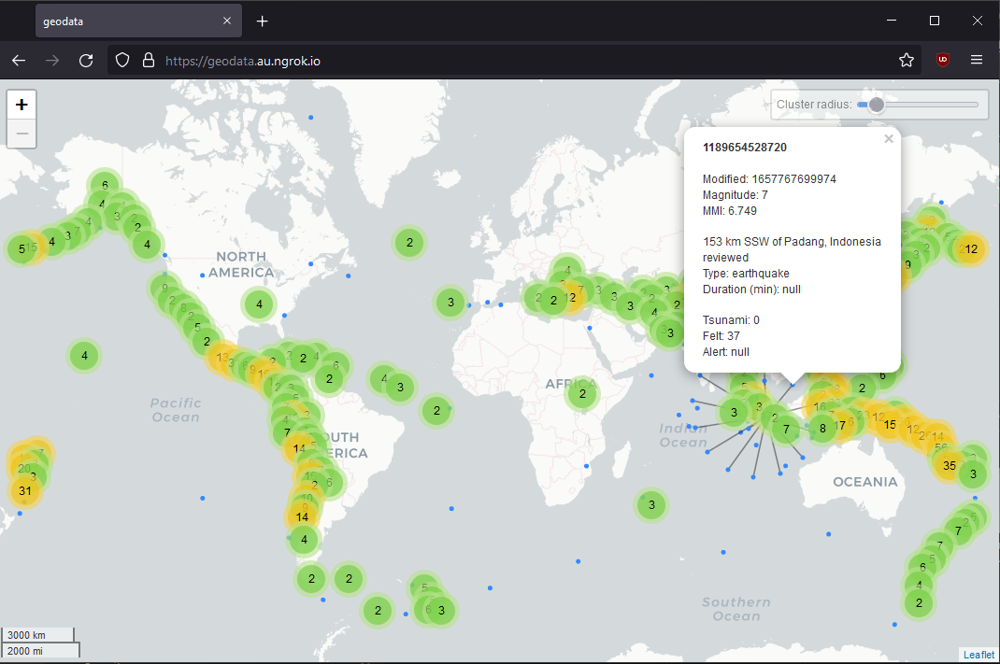

<h3>Geodata is an application used to visualize siesmic events.</h3>

 
Features:

* GeoNet & USGS data support.
* Minimal internet required.
* NGINX docker support.
* Lightweight & very fast.
* Highly secure.
* Event clustering.
* Scaleable.
* Client-side processing.

 
Planned:

* Statistics.
* USGS time & date.
* Map interaction features.
* Cluster colour.
* Cluster-land colour.
* Time-based colour.
* Mag-based colour.
* Swarm detection.
* Magnitude - event size.
* Offline support

 

<h2>Test Data</h2>

* GeoJSON format - *String values only*

 

<h3>Kai.json</h3>

 

<h3>map.json</h3>

 

<h3>USGS_1Y.json</h3>

 

<h3>USGS_7+.json</h3>

 
  

<h2>Docker</h2>

`docker pull nginx`

`docker run -it --rm -d -p 80:80 -v geodata:/usr/share/nginx/html nginx`

