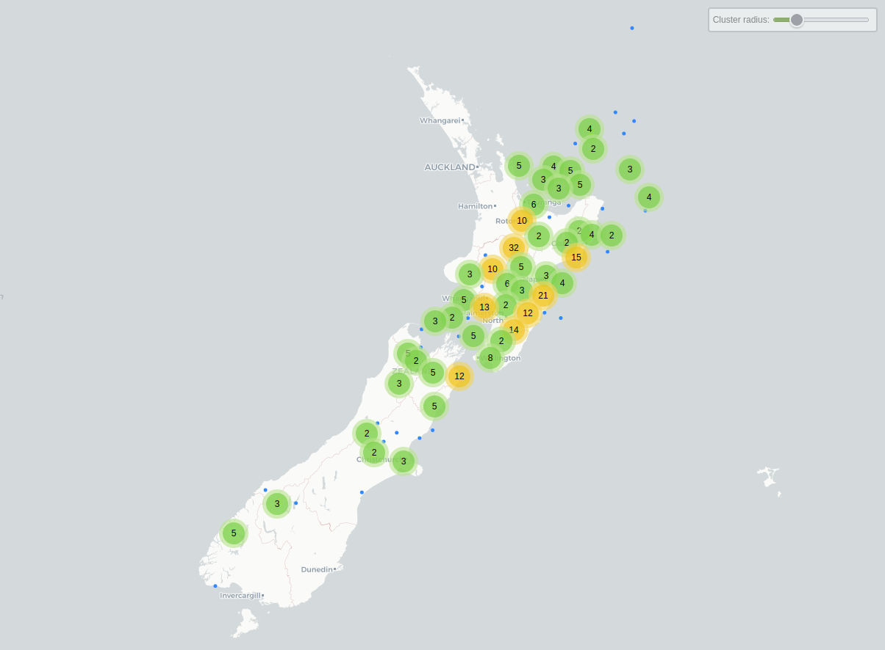
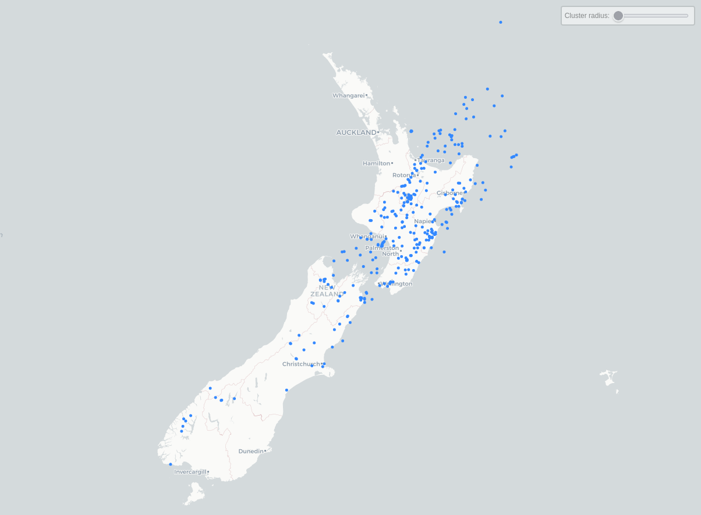
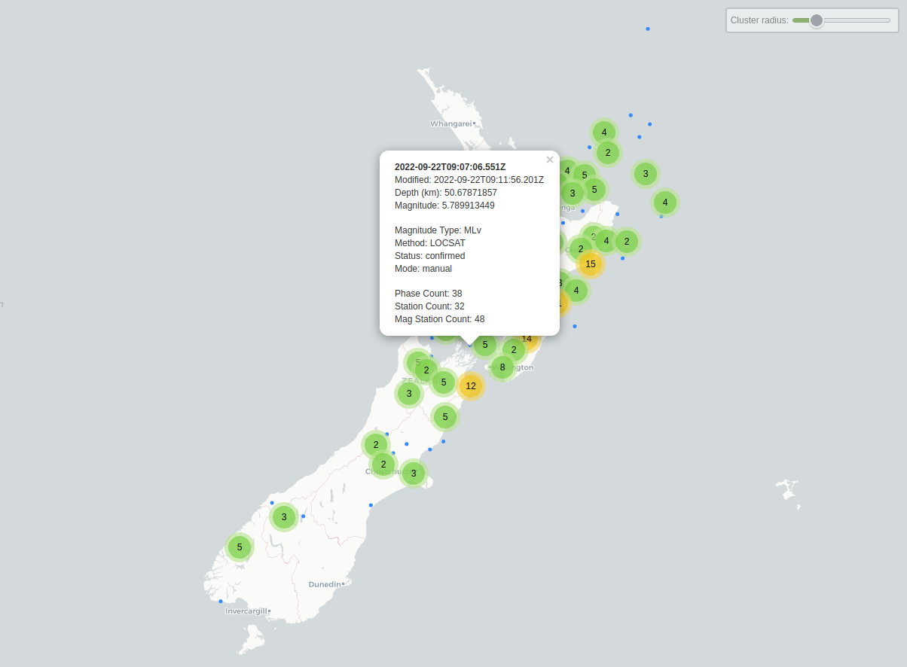
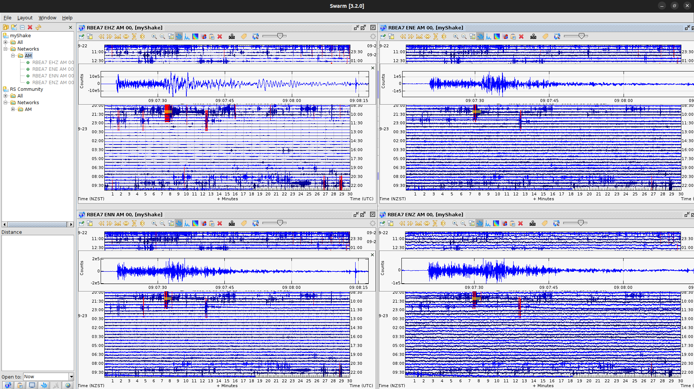
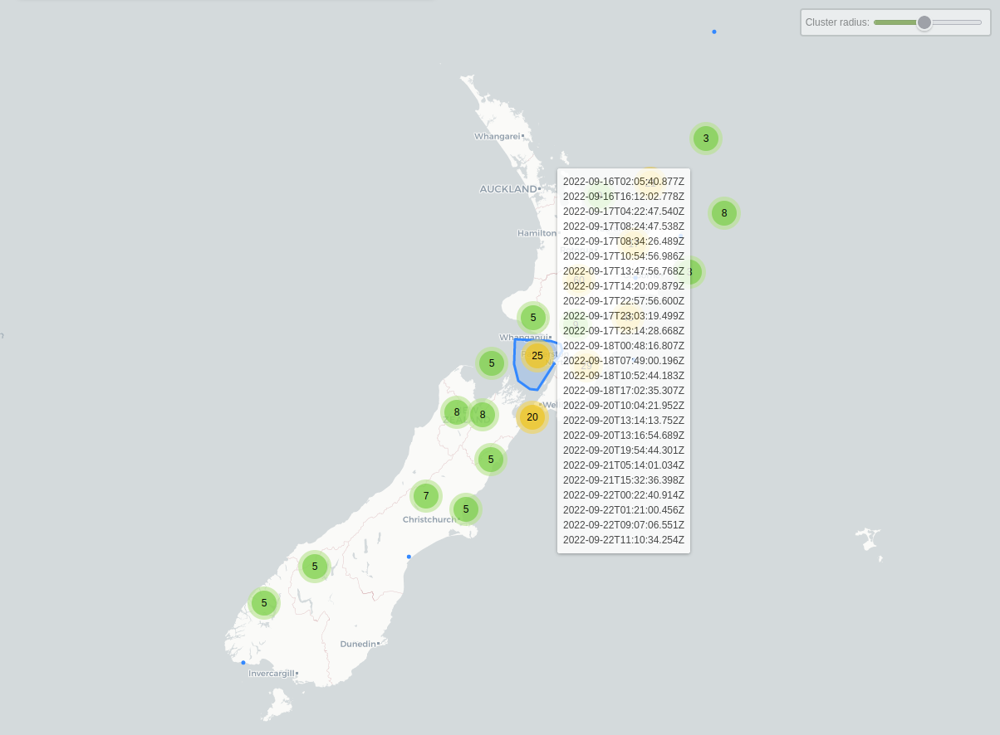
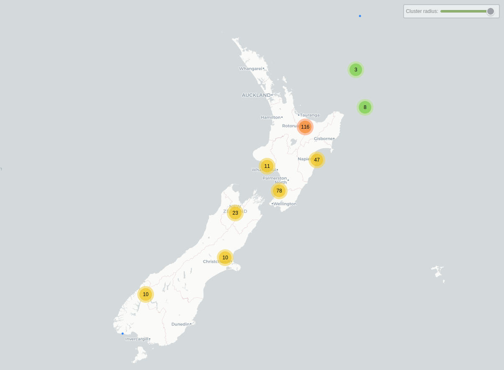
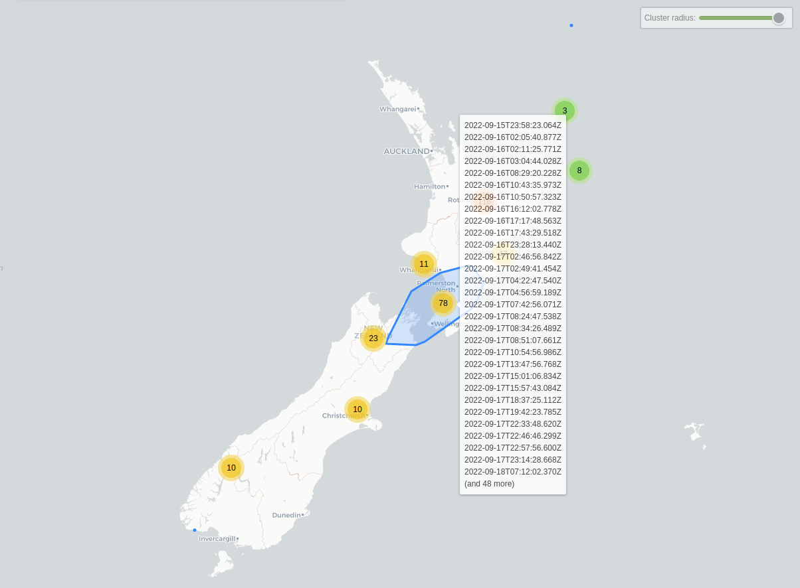
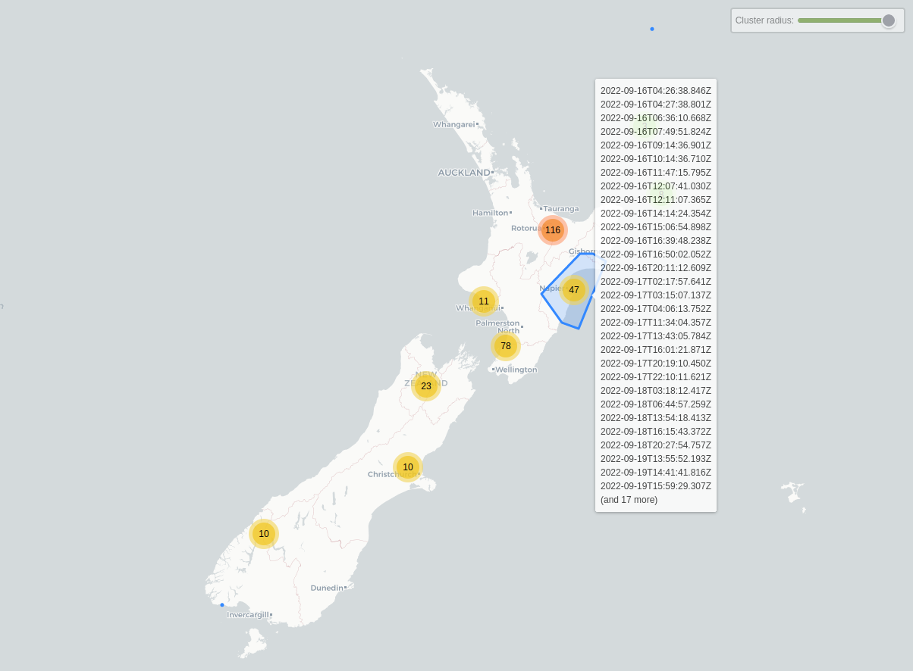
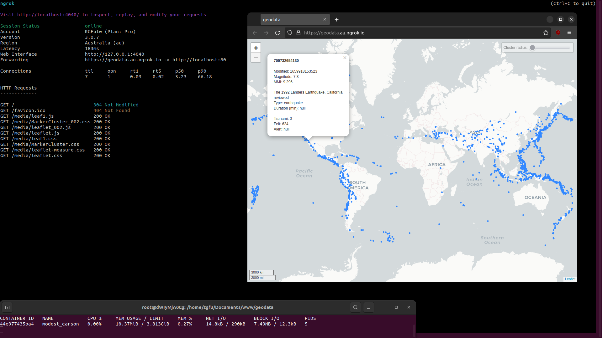

<h3>Geodata is an application used to visualize local and worldwide siesmic events.</h3>

 
Features:

* GeoNet & USGS data support.
* Minimal internet required.
* NGINX docker support.
* Lightweight & very fast.
* Highly secure.
* Event clustering.
* Scaleable.
* Client-side processing.

 
Planned:

* Statistics.
* USGS time & date.
* Map interaction features.
* Cluster colour.
* Cluster-land colour.
* Time-based colour.
* Mag-based colour.
* Swarm detection.
* Magnitude - event size.
* Offline support

 

[<h2>Data</h2>](./DATA.md)

[GeoJSON](./1W_GeoNet.json)

22-Sep 2022 - M5.8 South Island of New Zealand

 

<h3>Clustering</h3>

 

<h2>Docker NGINX Server</h2>
Within this directory run:

* `chmod -R ugo+rwx geodata`
* `docker pull nginx`
* `sudo docker run -it --rm -d -p 80:80 -v $(pwd)geodata:/usr/share/nginx/html nginx`

Read more about [securing]() Docker containers.